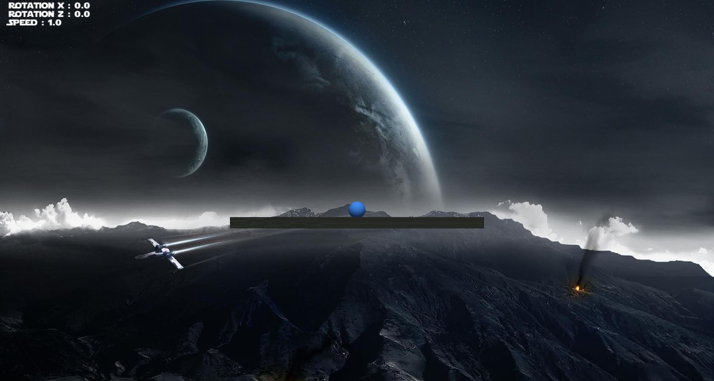
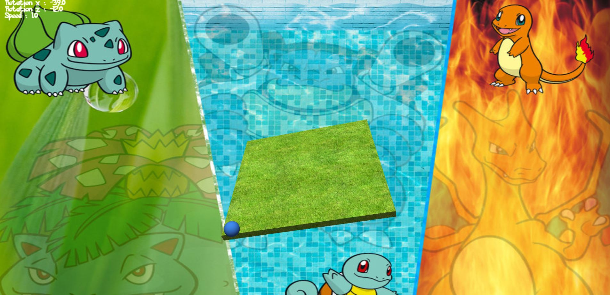
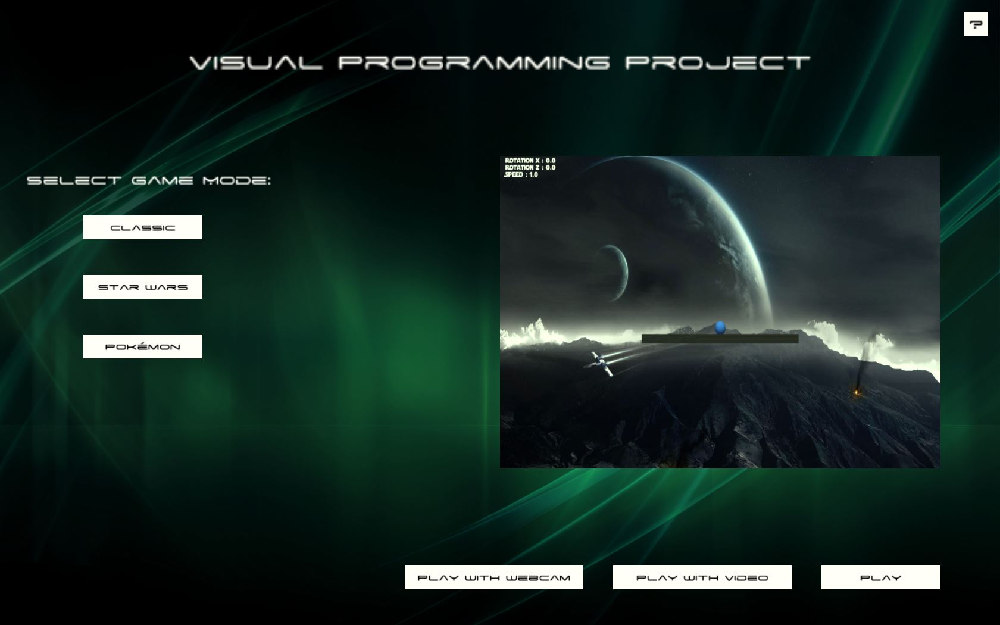
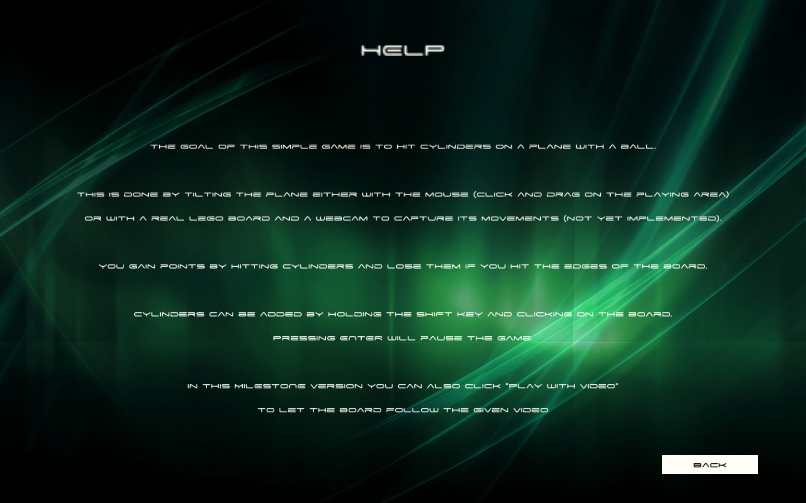
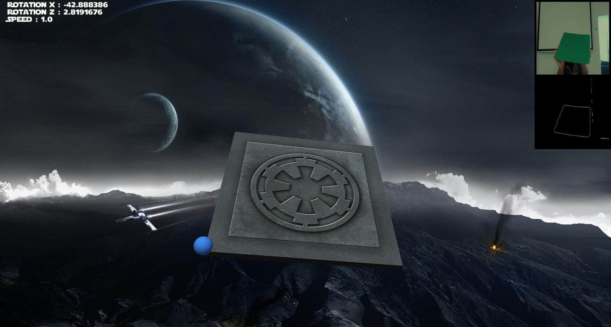
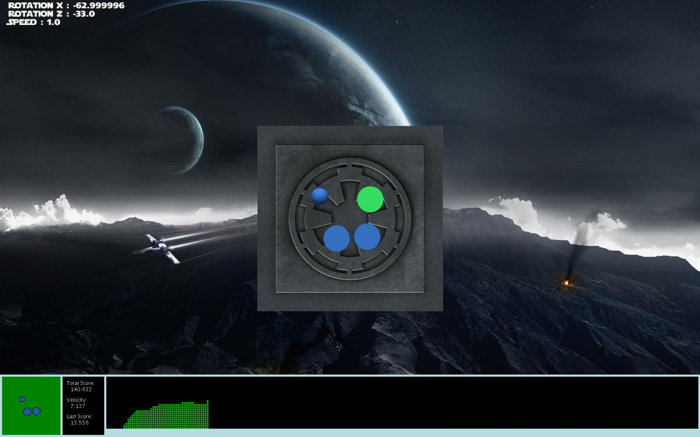

# Tangible Game

Tangible user interface game controlled by moving a lego board on front of the camera.
Developed in the context of the course _CS-211 Introduction à l'informatique visuelle_ at École polytechinque fédérale de Lausanne (EPFL).

The implementation was subdivided in three main phases.
- Implementation of the game itself.
- Implementation of the edge detection algorithm.
- Incorporation of the edge detection algorithm inside the game.

Note that the parameters of the edge detection algorithm are optimized for our testing room, you may need to adjust them in order to obtain optimal results.
In order to move the plane correctly, you may also adapt the reference system depending on where you position your webcam.

## The Game
_The goal of this simple game is to hit cylinders on a plane with a ball.
This is done by tilting the plane either with the mouse (click and drag on the playing area) or with a real lego board and a webcam to capture its movements.
You gain points by hitting cylinders and lose them if you hit the edges of the board.
Cylinders can be added by holding the `SHIFT` key and clicking on the board.
Pressing `ENTER` will pause the game.
You can also click "Play with Video" to let the board follow a prerecorded video._

Note that you can access the above description, by pressing the `?` in the top-right corner, from both the main and the resume menu.

## Game Layout
We have implemented three different game layouts: _Classic_, _Star Wars_ and _Pokèmon_.
As an addition, when playing in _Star Wars_ mode, the Star Wars theme is played in background.

## Requirements
To play using real time edge detection you will need:
- A green lego board
- A webcam

## How to run
In the `application`folder you find the linux and the windows versions of the game compiled as Java applications.

Alternatively, you can install [Processing](https://processing.org/) and the [Papaya](http://adilapapaya.com/papayastatistics/) library in order to launch the game directly from processing.

## License
MIT licensed, details in [LICENSE.md](./LICENSE.md)

## Authors
- Albergoni Tobia - [aTobyWanKenobi](https://github.com/aTobyWanKenobi)
- Conti Riccardo - [craiker](https://github.com/craiker)
- Romerio Lucio - [lromerio](https://github.com/lromerio)

## Screenshots

